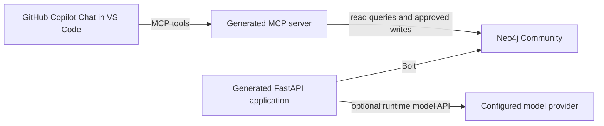

# Plan 001: GitHub Copilot Integration for the Context Graph

## Decision

Use GitHub Copilot in VS Code as the interactive client for the manufacturing
context graph through MCP. Do not treat Copilot Chat as a callable model API
inside the generated FastAPI application.

The generated application's agent requires a runtime model provider. Keep that
provider configurable and use a supported API-backed provider, such as GitHub
Models, OpenAI, or Anthropic, only when running the in-app chat experience is
required.

## Scope

This plan applies after `create-context-graph` is cloned in a separate step.
It does not clone a repository, create credentials, or modify a `.env` template.

## Target Architecture

## Phase 1: Establish a Reproducible Local Baseline

1. Clone `neo4j-labs/create-context-graph` into a separate working directory.
2. Create a self-hosted Manufacturing scaffold that targets the existing local
   Neo4j Community container at `bolt://localhost:7687`.
3. Verify the scaffold can connect to Neo4j and seed the generated fixtures.
4. Record the generated project path, Neo4j database name, and exposed HTTP and
   Bolt ports in project documentation.

**Exit criteria:** a Bolt query returns the expected manufacturing labels and
the generated backend's connection check succeeds.

## Phase 2: Make the Runtime Model Provider Explicit

1. Locate the generated agent template for the selected framework. For the
   PydanticAI path, the current template initializes an Anthropic model directly.
2. Replace the hard-coded provider/model identifier with configuration-driven
   selection, for example `AGENT_MODEL` and provider-specific settings.
3. Preserve the existing Neo4j tools, system prompt, streaming route, and
   conversation-memory behavior while changing only model construction.
4. Implement a startup validation that reports a clear configuration error when
   a selected provider lacks its required credential.
5. Add tests for provider selection and the missing-credential error; use a
   PydanticAI test model in unit tests so tests do not call a remote model.

**GitHub Models option:** select a model/provider combination supported by the
installed PydanticAI version and authenticate with a GitHub token that is
authorized for GitHub Models. Confirm the exact provider syntax from the
installed PydanticAI documentation before implementation; do not reuse a
Copilot subscription token as though it were a general backend API key.

**Exit criteria:** the backend starts with a test model without a third-party
LLM credential, and starts with the chosen production provider only when its
credential is supplied.

## Phase 3: Expose Context-Graph Tools Through MCP

1. Generate the project with its MCP option enabled, or add the generator's
   MCP template to the existing generated project.
2. Limit the initial MCP tool set to graph discovery and read-only query tools:
   schema inspection, search, and parameterized Cypher reads.
3. Add write tools only after defining authorization, audit records, idempotency,
   and an allowlist for Cypher operations.
4. Configure GitHub Copilot in VS Code to launch the MCP server using the
   generated project's local Python environment and configuration.
5. Test tool discovery in Copilot Chat and execute a read-only manufacturing
   query through the MCP connection.

**Exit criteria:** Copilot can retrieve graph schema and answer a manufacturing
question using an MCP tool result rather than unsupported inference.

## Phase 4: Align the Manufacturing Graph With the Billing Competencies

1. Add the order-management concepts from `plan002.2.md` to a domain ontology
   YAML file rather than relying on the scaffold's generic manufacturing
   fixtures.
2. Model the policy, evidence, result, provenance, grain, quantity-basis, and
   allocation concepts as distinct graph structures.
3. Add Cypher queries or MCP tools that directly answer CQ-01 through CQ-21.
4. Start with read-only competency checks for duplicate-labor use, split-shipment
   allocation, effective-dated rates, and unresolved local source codes.
5. Import a small synthetic billing fixture before connecting any ERP source.

**Exit criteria:** every competency question has a documented graph pattern,
a test fixture, and a query or MCP tool that returns evidence-backed results.

## Phase 5: Operational Guardrails

1. Keep the Neo4j password and model-provider credentials out of source control.
2. Separate local development credentials from deployment credentials.
3. Restrict MCP write access by default and log every approved mutation with its
   actor, source, timestamp, and affected graph identifiers.
4. Run schema constraints, fixture ingest, backend tests, and MCP smoke tests in
   continuous integration.
5. Document recovery steps for reseeding the local graph without deleting
   unrelated databases or volumes.

## Acceptance Criteria

1. GitHub Copilot in VS Code can use the local context graph via MCP.
2. The graph backend does not require an Anthropic credential unless Anthropic is
   the explicitly configured runtime provider.
3. The runtime model provider is selected by configuration, validated at startup,
   and covered by offline tests.
4. Neo4j remains the system of record for graph data and is reachable over Bolt.
5. Billing competency questions are answered by graph evidence and controlled
   queries, not by model-only responses.