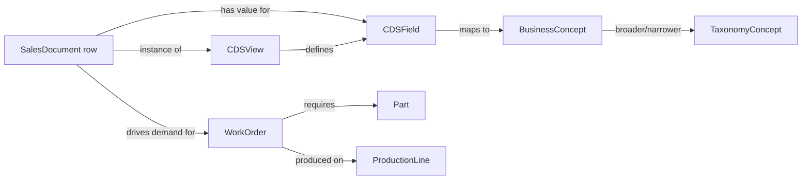

# Plan 002: SAP SALT Manufacturing Semantic Layer

## Decision

Use the cloned SAP SALT-KG dataset as a source of semantic metadata and
enterprise-table fixtures for the Manufacturing context graph. Keep the
existing manufacturing operations model intact. Add a separate metadata layer
that links SAP CDS views and fields to imported transactional records.

GitHub Copilot in VS Code remains the interactive graph client through MCP.
The generated FastAPI application continues to use its separately configured
runtime model provider; it must not call Copilot as a model API.

## Baseline

- Upstream source: `sap-salt/` cloned from `SAP-samples/salt-kg`.
- SALT-KG describes four enterprise tables and an Operational Business
  Knowledge Graph (OBKG) with field descriptions, dependencies, and business
  object types.
- The local snapshot contains five CDS-view metadata entries. Its
  `I_SALESDOCUMENT` entry defines 286 fields.
- `data/salt/salesdocuments.csv` contains 500,908 rows and 14 columns.
- The upstream dataset is licensed CC-BY-NC-SA-4.0 and reserves commercial
  text-and-data-mining rights. Treat copied or transformed dataset content as
  subject to that license and reservation; do not bundle it into the generator
  distribution until licensing review approves that use.

## Target Model



Create these domain entities without replacing the current `Part`,
`WorkOrder`, `Machine`, `ProductionLine`, `Supplier`, or `QualityReport`
entities:

- `CDSView`: URI, technical name, label, short description, source system.
- `CDSField`: URI, technical field name, label, ABAP type, long description,
  reference field, and source-system code.
- `BusinessConcept`: canonical business meaning, scope note, and external
  notation.
- `TaxonomyConcept`: SKOS-inspired canonical label, alternate labels,
  notation, and governance status.
- `SalesDocument`: document number, sales organization, type, distribution
  channel, division, currency, Incoterms, creation timestamp, and provenance.
- `SourceDataset`: source URI, version or commit, license, import timestamp,
  and row-count evidence.

Use typed relationships: `DEFINES_FIELD`, `INSTANCE_OF_VIEW`,
`HAS_FIELD_VALUE`, `REPRESENTS_CONCEPT`, `BROADER_THAN`, `NARROWER_THAN`,
`EXACT_MATCH`, `CLOSE_MATCH`, `SOURCED_FROM`, and `DRIVES_DEMAND_FOR`.

`HAS_FIELD_VALUE` must model a value as a reified node when it needs field
provenance, source-code mapping, datatype preservation, or an audit trail.
For simple, query-heavy scalar values, retain a normalized property on
`SalesDocument` and retain the field-to-concept metadata relationship.

## KB Graph Workspace

Each document knowledge base owns its semantic artifacts in a versioned
`ontology/` directory. For `my-mrp-kb`, the canonical SALT manufacturing
location is `my-mrp-kb/ontology/salt/manufacturing/v1.0/`:

```
my-mrp-kb/
   ontology/salt/manufacturing/v1.0/
      manifest.json                    # Canonical artifact inventory and source contract
      salt-manufacturing.ttl           # RDF/OWL vocabulary
      salt-manufacturing.obda          # Ontop virtual-graph mapping
      salt-manufacturing.sparql        # Read-only smoke query
      acceptance/*.sparql              # Lineage, provenance, and semantic checks
      ontop.ps1            # validate, query, and endpoint commands
```

`manifest.json` is the authoritative inventory. New mappings, ontology modules,
and queries must be registered there before use. The initial mapping uses an
in-memory H2 bootstrap source so Ontop can validate the graph contract offline.
Production mappings replace only the datasource and source SQL; they retain the
same `ontology_id`, ontology IRIs, and query locations. Every generated ontology
must define the deterministic compound identifier `salt.manufacturing.v1.0` in
its manifest and as the RDF ontology identifier.

## Phase 1: License and Source Boundaries

1. Record the exact SALT commit SHA, source URLs, and dataset license in a
   provenance document.
2. Confirm whether CC-BY-NC-SA-4.0 content may be redistributed in generated
   fixtures, tests, and documentation. Obtain legal approval before copying
   source rows or metadata descriptions into `src/create_context_graph`.
3. Add `sap-salt/` to the repository contribution guidance as an independent
   cloned source, not a generated-project dependency.

**Exit criteria:** every imported artifact has source, commit, license, and
redistribution status recorded.

## Phase 2: Extend the Manufacturing Ontology

1. Add the metadata entities and relationships above to
   `src/create_context_graph/domains/manufacturing.yaml`.
2. Add constraints for stable semantic identifiers: view URI, field URI,
   concept URI, and sales-document number plus source-system scope.
3. Add source-code properties and mapping relationships for coded values such
   as sales organization, document type, payment terms, Incoterms, currency,
   and shipping condition.
4. Define SKOS-compatible fields (`pref_label`, `alt_labels`, `notation`,
   `scope_note`) as ordinary graph properties; do not require an RDF runtime.
5. Extend visualization colors and demo scenarios so metadata nodes are
   visually distinguishable from production-operation nodes.

**Exit criteria:** the ontology loader validates, generated Pydantic models
compile, and all new identifiers have uniqueness constraints.

## Phase 3: Build an Offline SALT Importer

1. Implement a dedicated importer that reads SALT metadata JSON and the
   selected transactional table without loading the full CSV into memory.
2. Map each metadata JSON view to one `CDSView` and each field object to one
   `CDSField`; preserve the supplied URI, description, ABAP type, and target
   column.
3. Normalize CSV headings to `CDSField.field_name`, preserving source text for
   identifiers with leading zeros such as `SALESDOCUMENT`.
4. Parse dates and times deterministically, explicitly define null handling,
   and retain the original row number or source key for reconciliation.
5. Make imports idempotent with source-scoped MERGE keys and a configurable
   row limit for developer fixtures.
6. Start with a small, representative sales-document sample. Full 500,908-row
   imports should be an explicit operator command, with batching and progress
   logging.

**Exit criteria:** repeated imports neither duplicate metadata nor transaction
records, and a sampled source row reconciles field-for-field with its graph
representation.

## Phase 3A: Validate with Ontop

1. Run `my-mrp-kb/ontology/salt/manufacturing/v1.0/ontop.ps1 validate` before merging an ontology or
   mapping change.
2. Keep `.obda` mappings, `.ttl` ontology files, and `.sparql` queries under
   the KB's versioned `ontology/` directory; do not scatter them through application code.
3. Register every artifact and its purpose in `manifest.json`.
4. Run `ontop.ps1 query` as an offline smoke test. Use `ontop.ps1 endpoint`
   only when a mapped relational datasource is configured.

**Exit criteria:** Ontop validates the ontology and mapping in a pinned
container, and the baseline SPARQL query returns the knowledge-base resource.

## Phase 4: Manufacturing and Billing Semantics

1. Link `SalesDocument` instances to manufacturing demand only where source
   evidence establishes the link; do not infer a production order solely from
   a shared material code.
2. Add distinct structures for policy, evidence, result, provenance, grain,
   quantity basis, and allocation before implementing billing calculations.
3. Add effective-dated rate, shipment, delivery, billing, and allocation
   concepts as separate entities rather than properties on a sales document.
4. Capture unresolved source-code mappings as graph findings with source field,
   raw code, candidate concept, status, and reviewer.
5. Encode competency questions as parameterized Cypher tools. Initial checks
   must cover duplicate labor use, split-shipment allocation, effective-dated
   rates, and unresolved source codes.

**Exit criteria:** each competency question has a documented graph pattern,
synthetic fixture, evidence-backed query, and expected result.

## Phase 5: MCP and Application Access

1. Generate the project with `--self-hosted --with-mcp` and connect it to the
   local Neo4j Community instance.
2. Configure `.vscode/mcp.json` from the generated `mcp/vscode_mcp.json`.
3. Expose schema inspection, semantic field lookup, sales-document search, and
   parameterized read-only Cypher tools first.
4. Keep MCP writes disabled until authorization, audit records, idempotency,
   and an operation allowlist exist.
5. Keep GitHub Copilot credentials out of the generated FastAPI runtime; its
   web chat uses only its explicitly configured model provider.

**Exit criteria:** GitHub Copilot Chat retrieves a sales-document field
definition and answers a manufacturing question using MCP tool evidence.

## Tests and Acceptance Queries

Add offline tests for:

- Metadata JSON parsing and URI-preserving idempotent imports.
- Leading-zero document-number preservation and date/time normalization.
- Metadata-to-column coverage for the imported table.
- Constraint creation and source-scoped deduplication.
- Reconciliation of a known CSV sample to graph properties and provenance.
- Read-only MCP tool responses for field semantics and sales-document search.

Acceptance queries should demonstrate:

```cypher
MATCH (document:SalesDocument {sales_document: $id})
MATCH (document)-[:INSTANCE_OF_VIEW]->(view:CDSView)
MATCH (view)-[:DEFINES_FIELD]->(field:CDSField {field_name: $field_name})
OPTIONAL MATCH (field)-[:REPRESENTS_CONCEPT]->(concept:BusinessConcept)
RETURN document, view, field, concept
```

```cypher
MATCH (finding:SourceCodeFinding {status: 'unresolved'})
RETURN finding.source_field, finding.raw_code, finding.candidate_concept
ORDER BY finding.source_field, finding.raw_code
```

## Non-Goals

- Do not load the entire SALT dataset as default scaffold fixtures.
- Do not treat source-field descriptions as authoritative business policy.
- Do not implement MCP mutation tools in the first release.
- Do not use GitHub Copilot Chat as a callable model API from FastAPI.