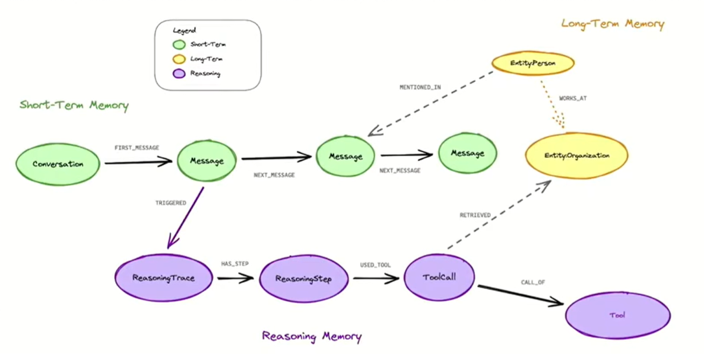

## Summary
v1.4 adds:
ASCII diagrams for the Context Graph and agent flow
A concrete Context Graph API (STM, LTM, RM)
A full agent decision‑trace schema
A Reasoning Memory Audit Log format

## Plan-009
## Agent Memory Service

